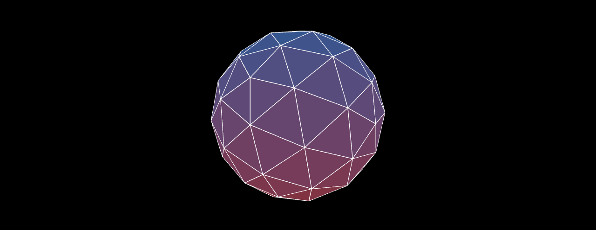

# 🌐 3jsSphere

A modern, interactive **sphere** created with **HTML**, **JavaScript**, and **Three.js**. It features smooth animations and a sleek design to provide a visually stunning 3D experience.

## ✨ Features
- Fully interactive 3D sphere
- Smooth animations with Three.js
- Lightweight and clean design

## 📸 Snapshot

## 🚀 Tech Stack
- **HTML**
- **JavaScript**
- **Three.js**

## 📄 License
MIT License © 2025 Yahia Badr

## 🌐 Demo
[Live Demo](#) (Add link to your hosted demo)
